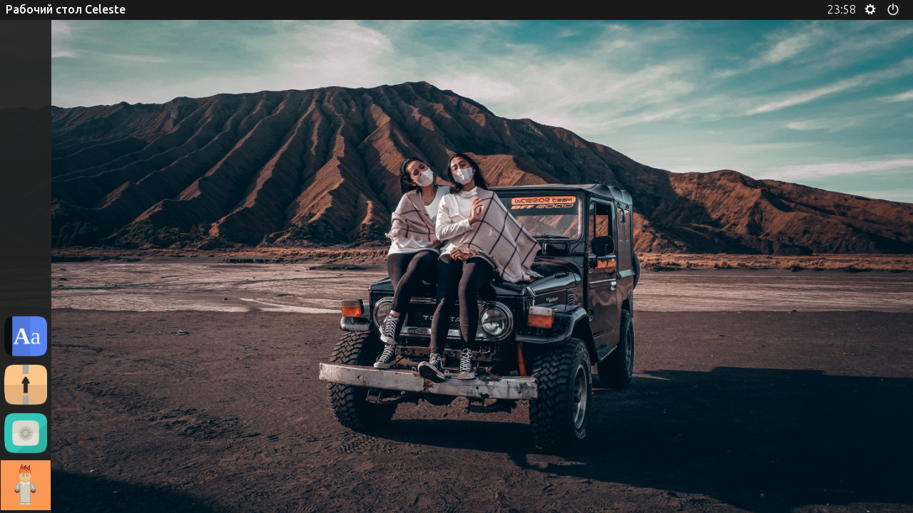

<h1></h1>

 

Candella — это форк [фреймворка AliceOS](https://aliceos.app), созданного на Ren'Py, который поставляет операционную среду в визуальные романы. Эта операционная среда включает в себя утилиты, классы и прочий код, который даёт возможность разработчикам и игрокам писать и использовать приложения, созданные для этой системы.

## Отличия от AliceOS

- **Совместимость релизов**: Цикл релизов системы Candella синхронизируется с обновлениями функций игры "Не по сценарию" и программы Ren'Py SDK соответственно.
- **Оперативная обратная связь**: Система AliceOS придерживается графика выпуска новых версий и обновляется не так часто с учётом исправлений багов или улучшений, а Candella, в свою очередь, получает отзывы как от публики, так и от тестеров, участвующих в программе [Unscripted Playtesting Program][uvn-beta].
- **Нацеленность на игру "Не по сценарию"**: Система Candella добавляет новые функции и улучшения, которые будут полезны в игре "Не по сценарию", как, например, нативная поддержка языка NadiaVM.
- **Упрощённая разработка приложения**: Расширения фреймворка приложений Candella облегчают быструю разработку приложений без необходимости возиться с делегирующими вызовами, также существует курируемый репозиторий проектов, из которого игроки могут скачивать и куда разработчики могут загружать релизы.

## Первые приготовления

### Быстрый старт: Получить систему Candella

Игра "Не по сценарию" поставляется вместе с последним релизом системы Candella и может быть скопирован в любой проект на Ren'Py. Откройте директорию файлов игры и скопируйте архив "candella.rpa" в свой проект на Ren'Py.

Также вы можете скачать копию на [странице Релизов][releases] и [скачать проект на Itch.io](https://marquiskurt.itch.io/candella).

### Сборка из исходников

#### Требования
- [Ren'Py SDK][renpy] версии 7.4.0 или выше
- Python 3
- Pipenv

Клонируйте репозиторий с GitHub, затем выполните команду `pipenv install -d` в корневой папке проекта, чтобы получить зависимости для создания проекта.

Чтобы собрать данный проект, откройте Лаунчер Ren'Py, выберите "Построить дистрибутивы" и выберите "Распространяемый пакет системы Candella". Конечный файл будет упакован в ZIP-архив и иметь название `candella.rpa`.

#### Тест-драйв функций

Если вы хотите опробовать некоторые из имеющихся функций без необходимости собирать что-либо, клонируйте репозиторий и запустите проект из Лаунчера Ren'Py.

## Лицензия

Система Candella лицензирована по условиям лицензии BSD-2-Clause согласно условиям лицензирования оригинального проекта AliceOS.

## Дополнительные примечания

Данный проект является полным переводом [оригинального проекта](https://github.com/UnscriptedVN/candella) на русский язык и адаптацией для корректной работы на последней версии Ren'Py (7.4.5.1648). Ошибки и недочёты в локализации прошу оставлять здесь: https://vk.com/topic-165582702_39071884

<!-- Links -->

[releases]: https://github.com/UnscriptedVN/candella/releases/
[uvn-beta]: https://beta.unscriptedvn.dev
[renpy]: https://renpy.org
