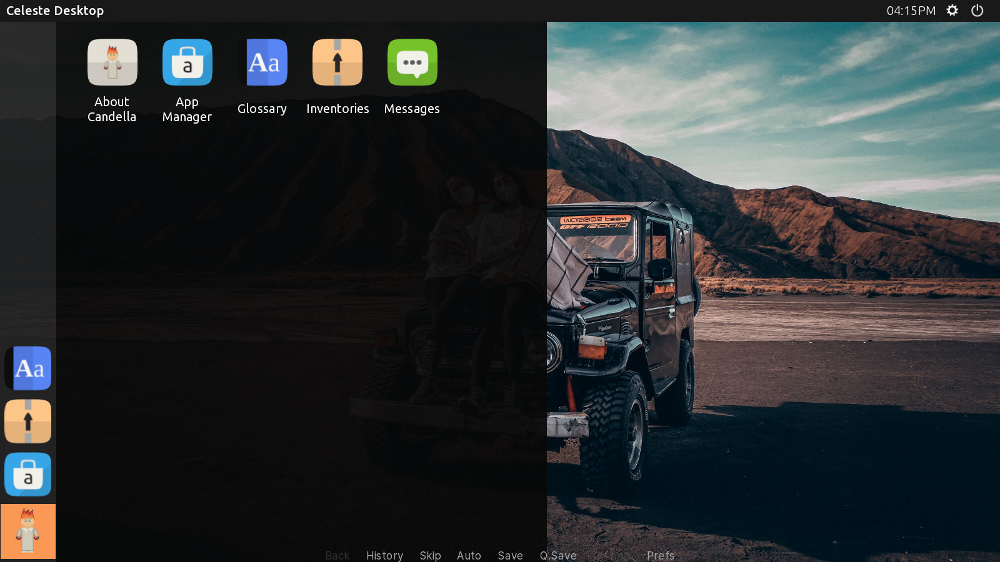
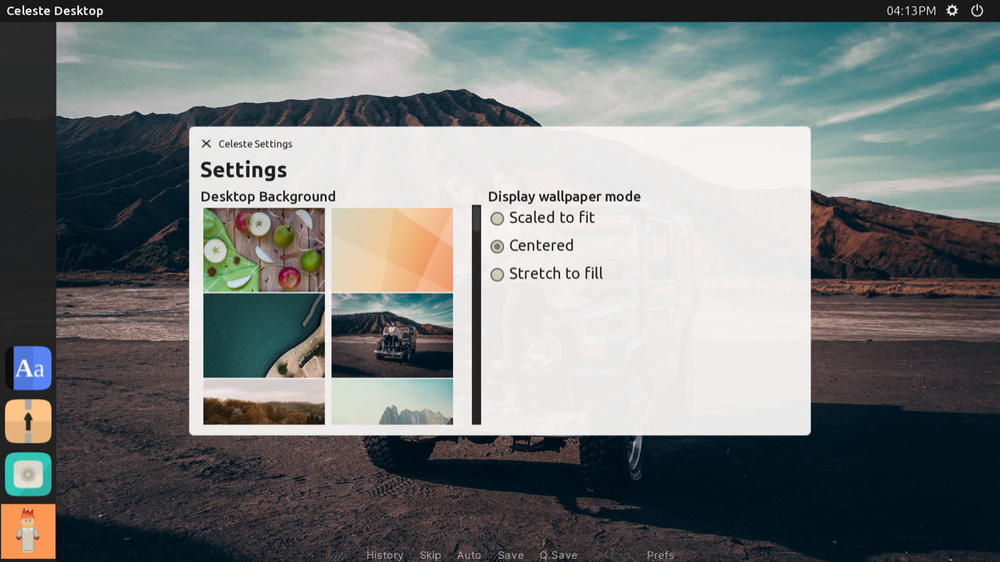
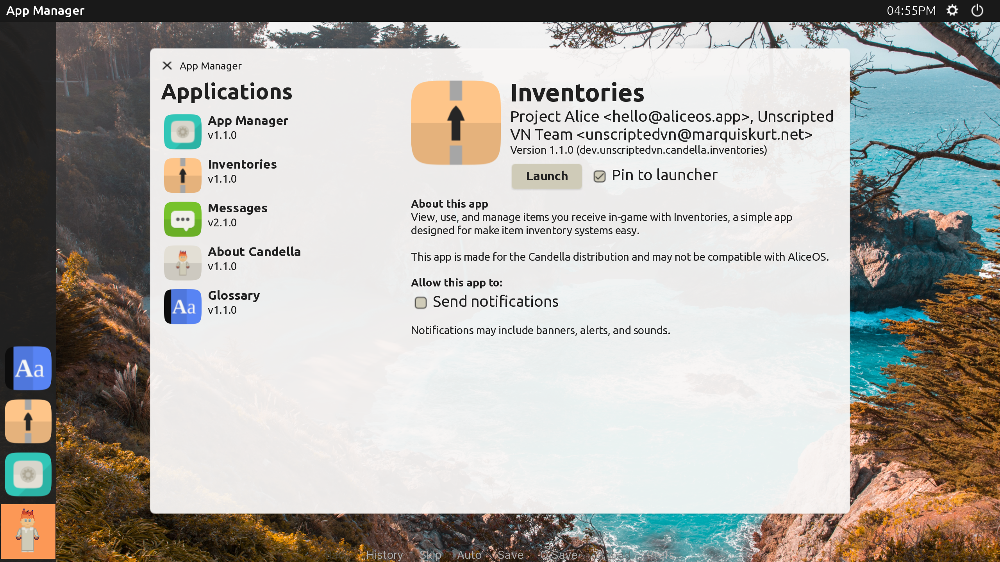

# Celeste Shell

The default desktop shell for Candella is **Celeste** (formerly known as Caberto Shell). Celeste's interface is mainly inspired from the [Lomiri][lomiri] desktop environment and comes with per-user customizations.

!!! warning
    Celeste is currently in a pre-release state and the documentation here may change as the project evolves.

## Using Celeste Shell

There are two major components to Celeste Shell: the top bar and the launcher on the left-hand side of the screen. In the top bar, you can view the currently-running application's name, the current user, the time, and a few status indicators for settings and exiting the desktop. The launcher on the left displays favorite apps and provides the main entry point to access all apps.

### Customizing the desktop {label:updated}

Click on the gear in the top bar to open the Settings pane for Celeste Shell. There are two sections in the settings: wallpaper selection, followed by the wallpaper display mode, which can be one of three options:

- `Scaled to fit` will try to fill the entire area of the display along the image's width and center it in the screen.
- `Centered` will center the image and fit the entire area of the display along the image's height.
- `Stretch to fill` will stretch the image to fit the display.

### Switching users

To switch the current user that's logged in to the system, click on the current user's name in the top bar and then select the user to switch to.

### Pinning apps to the launcher

The App Manager app provides access to pinning apps. Open the App Manager app, click on the app you want to pin from the left side, and then check the box labeled "Pin to launcher", next to the launch button.

## Available methods for developers

Celeste Shell provides some static methods that developers can use to get information present in Celeste Shell easily:

- `CelesteShell.get_all_applications()` returns all of the classes and instanced apps available to Candella.
- `CelesteShell.wallpapers()` returns a list containing the names of the wallpapers available to Celeste Shell.
- `CelesteShell.current_time()` returns a string that represents the current time on the system.

[lomiri]: https://lomiri.com