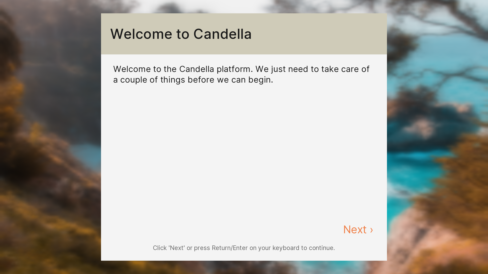

# Thorax Setup

Candella utilizes a new setup assistant called **Thorax**. Thorax is a modern, modular implementation for setup assistants in Candella and defines steps with a simple JSON file as a script.



## Running the default setup

In most cases, you'll want to use the default set of setup instructions, which lets users know about Candella, set up a new user, and finish setup (this set is equivalent to AliceOS's Express Mode in their setup assistant).

The Roland Boot Manager will automatically run Thorax with the default steps when it has detected that the system hasn't been set up, or the assistant needs to run again.

To use the default set and run setup at any time, call the `launch` method, without any additional arguments:

```
setup.launch()
```

## Writing a custom setup script

If you want to perform additional actions with the Thorax setup assistant, you can create your own setup script. Thorax uses a JSON file with a list of setup objects to perform steps accordingly.

A step is defined by the following keys:

- `name`: The name of the step to display in the top bar of the screen.
- `detail`: A paragraph that provides a description of the step or instructions for the user to follow.
- `keyboard_input`: Whether the user needs to type something into an input field to process the step.
- `callback`: (Optional) The name of the callback function to execute when the user presses 'Next' or Enter/Return on their keyboard. The callback must accept a single argument. By default, Thorax includes two callbacks: `create_user` and `complete`.

An example setup script can be seen here: 

```json
[
    {
        "name": "Create a user account",
        "detail": "Enter the name of the user you wish to create for this system.",
        "keyboard_input": true,
        "callback": "create_user"
    }
]
```

To run the setup assistant with these custom steps, call `launch` and pass the path to the JSON file as an argument:

```py
setup.launch("path/to/setup_script.json")
```

### Adding custom callbacks

You may need to write a custom callback if you wish to perform another action besides creating a user and acknowledging that the setup assistant completed. To do this, create a function that accepts a single argument and use `setup.add_setup_callback` to add it to the setup callback registry:

```py
def set_machine_name(name):
    persistent.AS_MACHINE_NAME = name

setup.add_setup_callback("set_machine_name", set_machine_name)
```

`add_setup_callback` requires two arguments:

- `name` (str): The name of the callback as defined in the setup script
- `callback` (callable): The function to run when the step completes